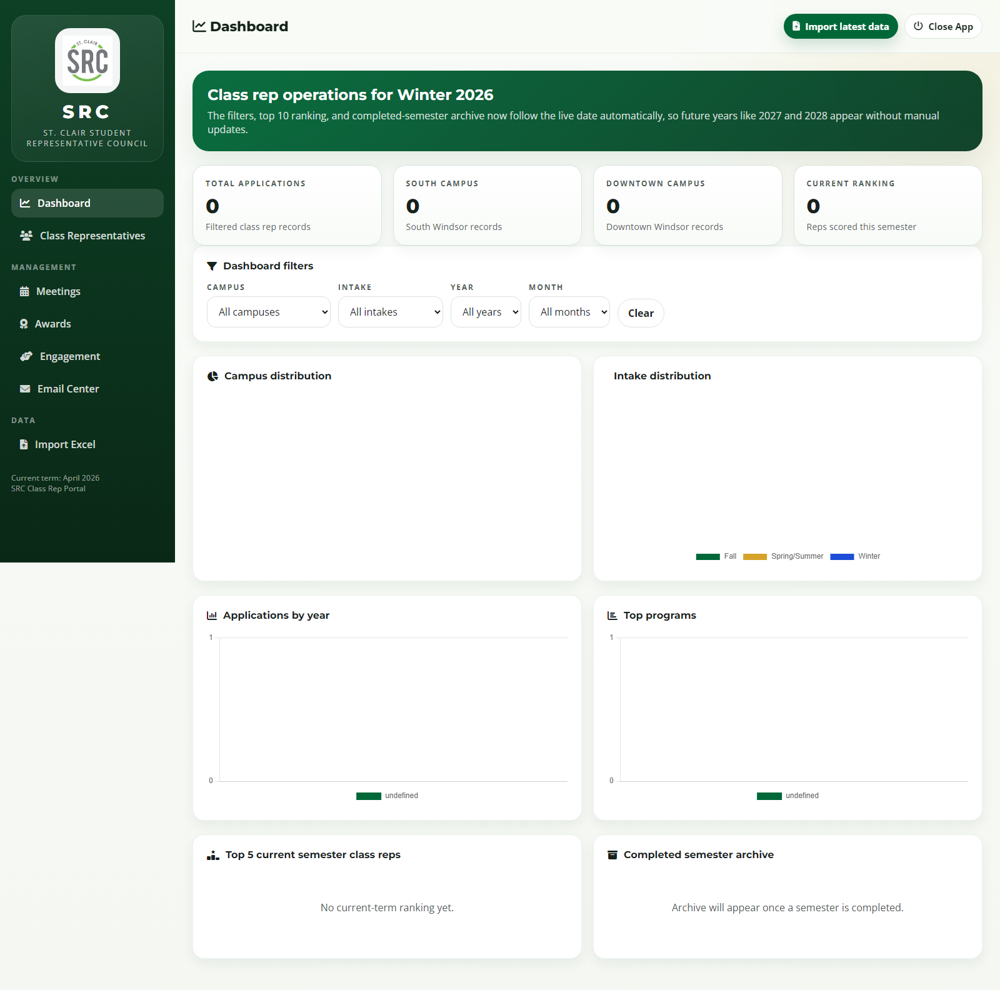
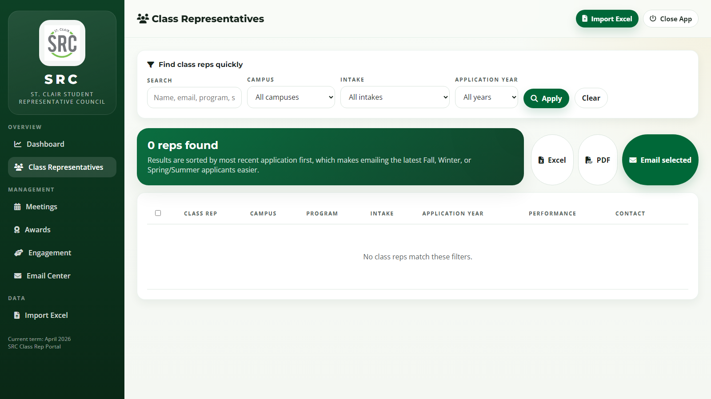
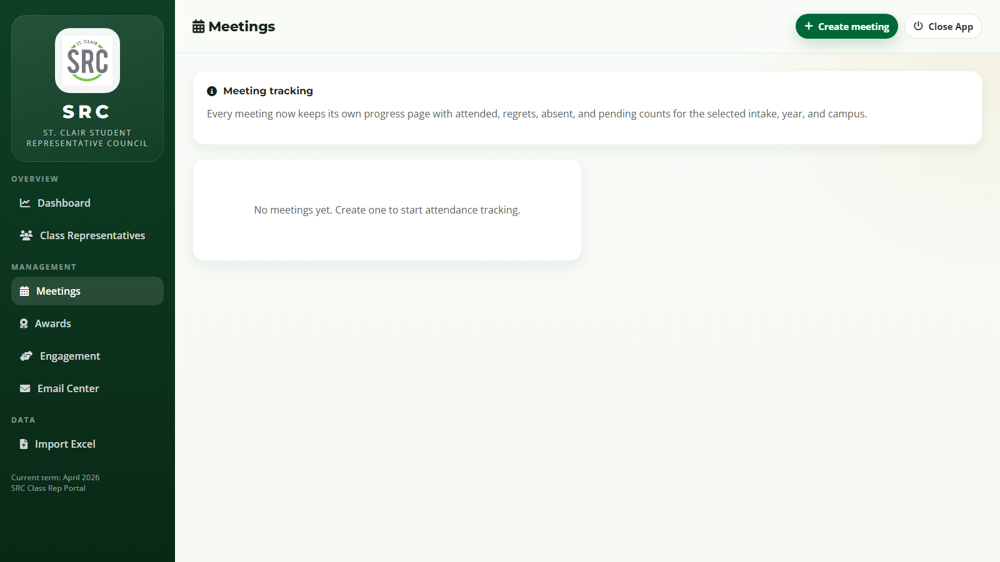
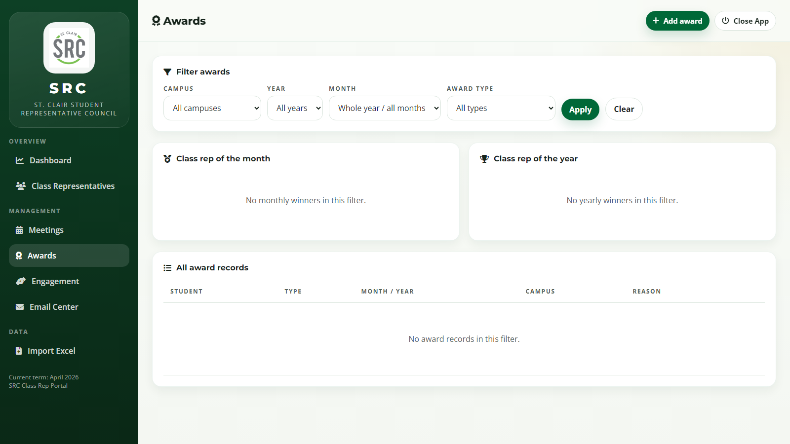
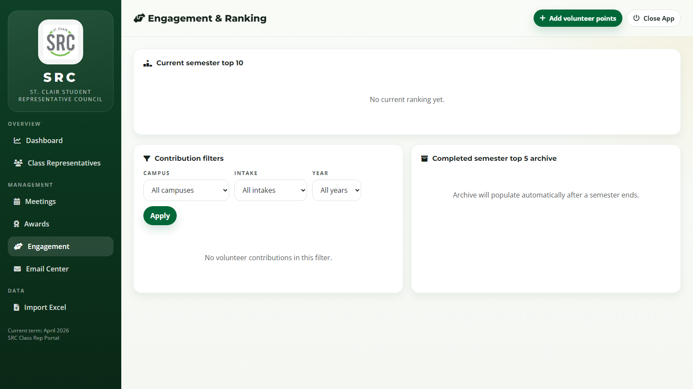
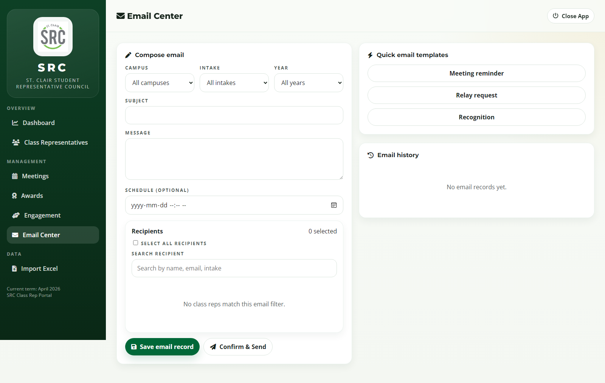

# SRC Class Representative Portal

Web app for managing class representative applications, meetings, awards, engagement points, ranking, and bulk email workflows.

## Preview








## Core Features

- Dashboard with live term summary and top reps
- Class rep directory with search + campus/intake/year filters
- Meeting creation and attendance tracking (`attended`, `regrets`, `absent`)
- Awards (monthly + yearly) with filters
- Engagement points + term ranking + archive
- Email center with templates, recipient search, select-all, and send confirmation
- Points history in rep detail (explains why score changed)

## Security Access (for shared link use)

This app supports login protection through environment variables:

- `SRC_PORTAL_ADMIN_USERNAME`
- `SRC_PORTAL_ADMIN_PASSWORD`

When both are set, only logged-in users can access and edit data.

## Data Persistence

Data is saved in local files under:

- `SRC_PORTAL_DATA_ROOT/data`
- `SRC_PORTAL_DATA_ROOT/uploads`

If `SRC_PORTAL_DATA_ROOT` is not set, app fallback paths are used.

## Railway Deployment

1. Create a **private** GitHub repository and push this project.
2. Create a Railway project and connect the repository.
3. Set these Railway variables:
   - `SRC_PORTAL_DATA_ROOT=/data`
   - `SRC_PORTAL_ADMIN_USERNAME=<your_admin_username>`
   - `SRC_PORTAL_ADMIN_PASSWORD=<your_strong_password>`
   - `SRC_PORTAL_OPEN_BROWSER=0`
4. Add a Railway **Volume** and mount it at `/data`.
5. Deploy.

`railway.json` and `Procfile` are included. Start command is `python run_portal.py`.

## Local Run

```bash
python -m venv .venv
.venv\Scripts\activate
pip install -r requirements.txt
python run_portal.py
```

